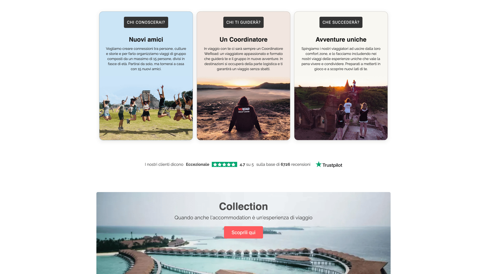

# **WeRoad Clone**

## **Descrizione**
Benvenute e Benvenuti su **WeRoad Clone**!  
Questo progetto open-source replica l'esperienza offerta da piattaforme di viaggio come WeRoad, integrando alcune novità per essere al passo con le esigenze moderne degli utenti.

### **Tecnologie utilizzate**
- **Frontend**:  
  - Angular 16  
  - Bootstrap  
  - NG Zorro  
- **Backend**:  
  - PHP Laravel  

Abbiamo incluso funzionalità nuove rispetto al sito originale, per essere sempre al passo con i tempi e soddisfare le aspettative degli utenti di oggi.

## **Screenshots**

### Homepage

### Pagina Dettaglio 

### Coordinatori e Avventure

### Footer e Partner

## **Autori e riconoscimenti**
- Filippo Gurrata 
- Michele Luca
- Gianluca Calvagna 

---

**Ci auguriamo che ti piaccia e non vediamo l'ora di ricevere i tuoi feedback e contributi!**

